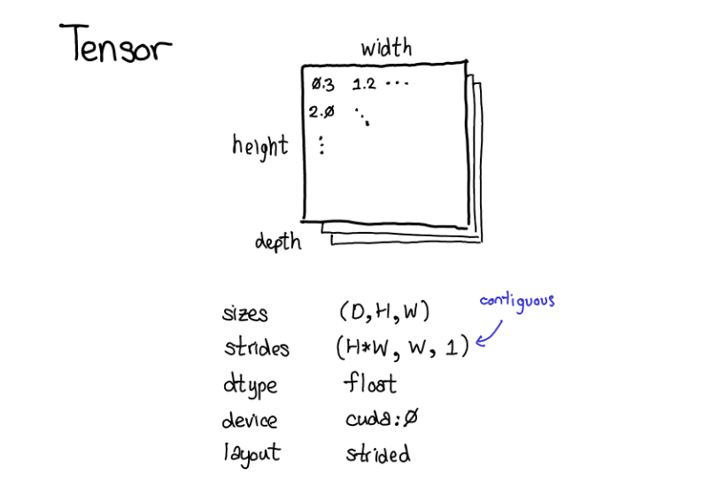

## tensor Operations

<div style="display: flex; justify-content: center; align-items: center;">
</div>

But what is a Tensor really? a tensor is a -dimensional matrix. Okay, but what is a torch.Tensor? Specifically, what actually happens when the following piece of code is run: a = torch.tensor(1.0, requires_grad=True). It turns out that PyTorch will allocate the data on the heap and returns the pointer to that data as a shared pointer 1

What happens when you create a tensor in using torch.tensor? 

Lets break down what happens when you create a tensor using `torch.tensor`:

`a = torch.tensor(1.0, requires_grad=True)`

1. **Memory Allocation**: PyTorch allocates memory on the **heap** to store the tensor data. The heap is a region of memory where dynamic memory allocation takes place.

2. **Data Storage**: The tensor data (in this case, the value `1.0`) is stored in the allocated memory.

3. **Metadata Creation**: PyTorch creates metadata for the tensor, which includes information such as:
	* **Data Type**: The data type of the tensor (e.g., float, int, etc.).
	* **Shape**: The shape of the tensor (in this case, a scalar).
	* **Stride**: The stride of the tensor (not applicable for scalars).
	* **Requires Grad**: A flag indicating whether the tensor requires gradient computation (in this case, `True`).

4. **Tensor Object Creation**: A `torch.Tensor` object is created, which wraps the allocated memory and metadata.

5. **Shared Pointer**: The `torch.Tensor` object is returned as a **shared pointer** to the allocated memory. This allows multiple references to the same tensor without copying the data.

6. **Registration in PyTorch's Tensor Registry**: The tensor is registered in PyTorch's internal tensor registry, which keeps track of all tensors in the system.

7. **Gradient Buffer Allocation**: Since `requires_grad=True`, PyTorch allocates a gradient buffer to store the gradients of the tensor during backpropagation.


## lets implement a Tensor

```
class Tensor:
    def __init__(self, data, requires_grad=False):
        self.data = data
        self.requires_grad = requires_grad
        self.grad = None

    def __str__(self):
        return f'Tensor(data={self.data}, requires_grad={self.requires_grad})'
```

This `Tensor` class has an `__init__` method that takes in `data` and an optional `requires_grad` flag. It also has a `__str__` method to provide a nice string representation of the tensor.

**Next steps:**

1. Implement `__add__` and `__mul__` methods for tensor addition and multiplication.
2. Consider adding a `backward` method to compute gradients when `requires_grad` is `True`.
3. You might want to add more metadata, such as `shape` and `dtype`, to your `Tensor` class.
4. Think about how you'll handle tensor operations with broadcasting and scalar values.

**Tensor Addition**

When adding two tensors, we need to consider their dimensions. Here are the rules:

* **Scalar addition**: If one tensor is a scalar (0D), it can be added to another tensor by broadcasting the scalar to match the shape of the other tensor.
* **Element-wise addition**: If both tensors have the same shape, we can add them element-wise.
* **Error**: If the tensors have different shapes and cannot be broadcasted, an error is raised.

**Tensor Multiplication**

When multiplying two tensors, we need to consider their dimensions. Here are the rules:

* **Scalar multiplication**: If one tensor is a scalar (0D), it can be multiplied to another tensor by broadcasting the scalar to match the shape of the other tensor.
* **Matrix multiplication**: If both tensors are 2D, we can perform matrix multiplication (dot product).
* **Element-wise multiplication**: If both tensors have the same shape, we can multiply them element-wise.
* **Error**: If the tensors have different shapes and cannot be multiplied, an error is raised.

**Tensor Dimensions and Broadcasting**

When performing tensor operations, we need to consider the dimensions of the tensors. Here are some key concepts:

* **Shape**: The shape of a tensor is a tuple representing its dimensions (e.g., (2, 3) for a 2x3 matrix).
* **Broadcasting**: When a tensor with a smaller shape is used in an operation with a tensor with a larger shape, the smaller tensor is "broadcasted" to match the shape of the larger tensor by repeating its values along the missing dimensions.

Now, let's implement the `__add__` and `__mul__` methods for our `Tensor` class. We'll start with scalar addition and multiplication, and then move on to element-wise operations.


**Tensor Addition**

The `__add__` method handles tensor addition. Here's a step-by-step breakdown:

1. **Check for scalar addition**: If one of the tensors is a scalar (0D), broadcast it to match the shape of the other tensor.
2. **Check for shape compatibility**: If both tensors have the same shape, perform element-wise addition. Otherwise, raise an error.

The formula for element-wise addition is:

`c[i] = a[i] + b[i]`

where `a`, `b`, and `c` are tensors, and `i` indexes the elements.

Here's the implementation:
```python
def __add__(self, other):
    if isinstance(other, (int, float)):  # scalar addition
        other = Tensor(other, requires_grad=self.requires_grad)
    if self.shape != other.shape:
        raise ValueError("Tensors must have the same shape for addition")
    return Tensor([a + b for a, b in zip(self.data, other.data)], requires_grad=self.requires_grad)
```
**Tensor Multiplication**

The `__mul__` method handles tensor multiplication. Here's a step-by-step breakdown:

1. **Check for scalar multiplication**: If one of the tensors is a scalar (0D), broadcast it to match the shape of the other tensor.
2. **Check for matrix multiplication**: If both tensors are 2D, perform matrix multiplication (dot product).
3. **Check for element-wise multiplication**: If both tensors have the same shape, perform element-wise multiplication. Otherwise, raise an error.

The formulas for matrix multiplication and element-wise multiplication are:

**Matrix Multiplication (Dot Product)**

`c[i, j] = sum(a[i, k] * b[k, j])`

where `a`, `b`, and `c` are tensors, and `i`, `j`, and `k` index the elements.

**Element-wise Multiplication**

`c[i] = a[i] * b[i]`

where `a`, `b`, and `c` are tensors, and `i` indexes the elements.

Here's the implementation:
```python
def __mul__(self, other):
    if isinstance(other, (int, float)):  # scalar multiplication
        other = Tensor(other, requires_grad=self.requires_grad)
    if len(self.shape) == 2 and len(other.shape) == 2:  # matrix multiplication
        if self.shape[1] != other.shape[0]:
            raise ValueError("Incompatible shapes for matrix multiplication")
        result_data = [[sum(a * b for a, b in zip(row, col)) for col in zip(*other.data)] for row in self.data]
        return Tensor(result_data, requires_grad=self.requires_grad)
    elif self.shape == other.shape:  # element-wise multiplication
        return Tensor([a * b for a, b in zip(self.data, other.data)], requires_grad=self.requires_grad)
    else:
        raise ValueError("Incompatible shapes for multiplication")
```


**Broadcasting**

When performing tensor operations, broadcasting is used to match the shapes of the tensors. Here are the broadcasting rules:

* If the tensors have different numbers of dimensions, the tensor with fewer dimensions is broadcasted to have the same number of dimensions by adding new axes (dimensions) with size 1.
* If the tensors have the same number of dimensions, but different sizes in some dimensions, the tensor with the smaller size in that dimension is broadcasted to match the larger size by repeating its values along that dimension.

For example, if we have two tensors `a` with shape `(2, 3)` and `b` with shape `(3,)`, broadcasting `b` to match `a` would result in `b` having shape `(1, 3)`, where the value of `b` is repeated along the new axis (dimension) with size 1.

**Tensor Dimensions and Shapes**

When working with tensors, it's essential to understand the concept of dimensions and shapes. Here are some key concepts:

* **Rank**: The number of dimensions in a tensor.
* **Shape**: A tuple representing the size of each dimension in a tensor.
* **Axis**: A single dimension in a tensor.

For example, a tensor with shape `(2, 3, 4)` has a rank of 3 and three axes: axis 0 with size 2, axis 1 with size 3, and axis 2 with size 4.


Now that we have implemented tensor addition and multiplication, let's move on to more complex tensor operations, such as:

* Matrix multiplication with broadcasting
* Element-wise operations with broadcasting
* Convolutional operations
* Tensor contraction and reduction

**Matrix Multiplication with Broadcasting**

To implement matrix multiplication with broadcasting, we need to consider the following cases:

* `a` is a 2D tensor, `b` is a 1D tensor (broadcast `b` to 2D)
* `a` is a 2D tensor, `b` is a 2D tensor (perform matrix multiplication)
* `a` is a 1D tensor, `b` is a 2D tensor (broadcast `a` to 2D)

Here's the updated implementation:
```python
def __mul__(self, other):
    if isinstance(other, (int, float)):  # scalar multiplication
        other = Tensor(other, requires_grad=self.requires_grad)
    if len(self.shape) == 2 and len(other.shape) == 1:  # matrix multiplication with broadcasting
        other = Tensor(other.data.reshape(-1, 1), requires_grad=self.requires_grad)
    elif len(self.shape) == 1 and len(other.shape) == 2:  # matrix multiplication with broadcasting
        self = Tensor(self.data.reshape(-1, 1), requires_grad=self.requires_grad)
    if len(self.shape) == 2 and len(other.shape) == 2:  # matrix multiplication
        if self.shape[1] != other.shape[0]:
            raise ValueError("Incompatible shapes for matrix multiplication")
        result_data = [[sum(a * b for a, b in zip(row, col)) for col in zip(*other.data)] for row in self.data]
        return Tensor(result_data, requires_grad=self.requires_grad)
    elif self.shape == other.shape:  # element-wise multiplication
        return Tensor([a * b for a, b in zip(self.data, other.data)], requires_grad=self.requires_grad)
    else:
        raise ValueError("Incompatible shapes for multiplication")
```
**Element-wise Operations with Broadcasting**

To implement element-wise operations with broadcasting, we need to consider the following cases:

* `a` is a 1D tensor, `b` is a 1D tensor (perform element-wise operation)
* `a` is a 2D tensor, `b` is a 1D tensor (broadcast `b` to 2D)
* `a` is a 1D tensor, `b` is a 2D tensor (broadcast `a` to 2D)

Here's the updated implementation:
```python
def __add__(self, other):
    if isinstance(other, (int, float)):  # scalar addition
        other = Tensor(other, requires_grad=self.requires_grad)
    if len(self.shape) == 1 and len(other.shape) == 1:  # element-wise addition
        return Tensor([a + b for a, b in zip(self.data, other.data)], requires_grad=self.requires_grad)
    elif len(self.shape) == 2 and len(other.shape) == 1:  # element-wise addition with broadcasting
        other = Tensor(other.data.reshape(-1, 1), requires_grad=self.requires_grad)
        return Tensor([a + b for a, b in zip(self.data, other.data)], requires_grad=self.requires_grad)
    elif len(self.shape) == 1 and len(other.shape) == 2:  # element-wise addition with broadcasting
        self = Tensor(self.data.reshape(-1, 1), requires_grad=self.requires_grad)
        return Tensor([a + b for a, b in zip(self.data, other.data)], requires_grad=self.requires_grad)
    else:
        raise ValueError("Incompatible shapes for addition")
```
**Convolutional Operations**

To implement convolutional operations, we need to consider the following cases:

* `a` is a 3D tensor (input), `b` is a 3D tensor (kernel)
* `a` is a 4D tensor (input), `b` is a 4D tensor (kernel)

Here's a basic implementation of convolutional operations:
```python
def conv2d(self, kernel):
    if len(self.shape) != 3 or len(kernel.shape) != 3:
        raise ValueError("Incompatible shapes for convolution")
    if self.shape[0] != kernel.shape[0] or self.shape[1] != kernel.shape[1]:
        raise ValueError("Incompatible shapes for convolution")
    result_data = []
    for i in range(self.shape[0] - kernel.shape[0] + 1):
        for j in range(self.shape[1] - kernel.shape[1] + 1):
            patch = self.data[i:i+kernel.shape[0], j:j+kernel.shape[1]]
            result_data.append(sum(a * b for a, b in zip(patch, kernel.data)))
    return Tensor(result_data, requires_grad=self.requires_grad)
```
**Tensor Contraction and Reduction**

To implement tensor contraction and reduction, we need to consider the following cases:

* `a` is a 2D tensor, `axis=0` (sum along rows)
* `a` is a 2D tensor, `axis=1` (sum along columns)
* `a` is a 3D tensor, `axis=0` (sum along first dimension)
* `a` is a 3D tensor, `axis=1` (sum along second dimension)
* `a` is a 3D tensor, `axis=2` (sum along third dimension)

Here's a basic implementation of tensor contraction and reduction:
```python
def sum(self, axis):
    if axis == 0:
        return Tensor([sum(row) for row in self.data], requires_grad=self.requires_grad)
    elif axis == 1:
        return Tensor([sum(col) for col in zip(*self.data)], requires_grad=self.requires_grad)
    else:
        raise ValueError("Invalid axis for sum reduction")
```

That's it for now! You've got a solid foundation for tensor operations.
We'll also explore advanced topics, such as:

* Tensor decomposition and factorization
* Tensor networks and graph-based representations
* Tensor optimization and compression
