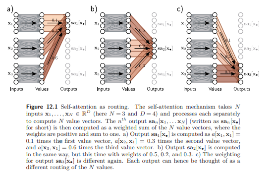

## Lets implement transformers from scratch

# Dot-product self-attention

lets look at the maths 
- get to know the nature of the input embedding
    - dimension
    - num heads
- query key and values
- np.matmul 
- softmax

